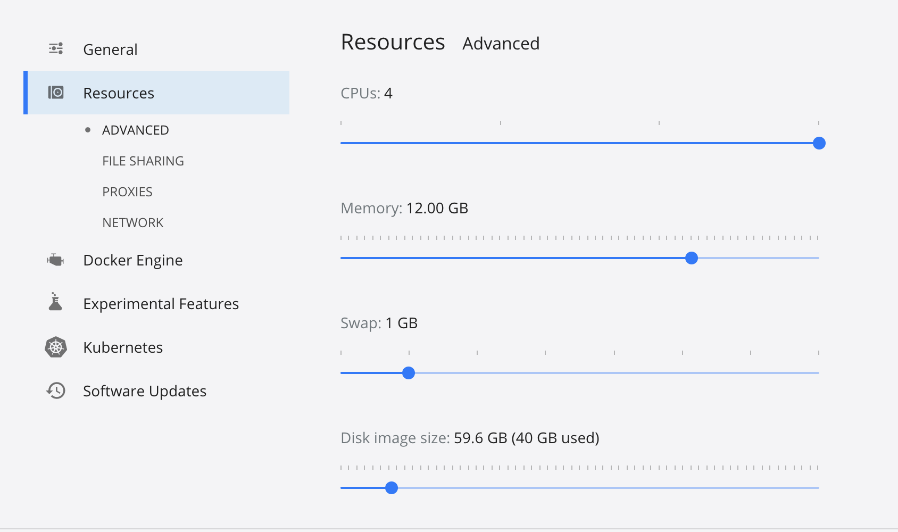

## Prerequisites

This quickstart is designed for Linux-based systems.
Consequently, use Linux, MacOS, or Windows subsystem for Linux v2 with a full virtual machine (WSL2).
Note that this tutorial has not been fully verified on  non-amd64 architectures (including Arm-based Apple M1).

The following tools need to be installed for this tutorial:

- [Docker](https://docker.com/) with minimum  4vCPUS, 12GB RAM, 20GB disk space left (see [FAQ](#faq))
- [kubectl](https://kubernetes.io/docs/tasks/tools/#kubectl) version `>= 1.19`
- [helm](https://helm.sh/) version `>= 3.3.0` - [Installation Guide](https://helm.sh/docs/intro/install/)
- [git](https://git-scm.com/downloads)
- [k3d](https://k3d.io) version `4.4.4`

All executables should be configured to be executable in the user space without `sudo` or equivalents.

### Installing K3d

 If you already have `k3d` installed, you can check its version by running `k3d --version`.
 This tutrial targets version `4.4.4` and may not work properly with older or newer versions.

```bash
curl -s https://raw.githubusercontent.com/rancher/k3d/main/install.sh | TAG=v4.4.4 bash
```

## Install Keptn

1. Start a [k3d](https://k3d.io) cluster for Keptn

    ```
    k3d cluster create mykeptn -p "8082:80@loadbalancer" --k3s-server-arg "--kube-proxy-arg=conntrack-max-per-core=0"  --k3s-agent-arg "--kube-proxy-arg=conntrack-max-per-core=0" --agents 1
    ```

2. **Download and install the [Keptn CLI](../0.11.x/reference/cli)**

    ```
    curl -sL https://get.keptn.sh | KEPTN_VERSION=0.11.4 bash
    ```

3. **Install Keptn** control-plane and execution-plane for continuous delivery use case or use the `helm install` version [mentioned below](#kubernetes-version-not-supported).

    ```
    keptn install --use-case=continuous-delivery
    ```

    Keptn comes with different installation options, please have a look at the [installation documentation](../0.11.x/operate) for more details on cluster requirements, resource consumption, supported Kubernetes versions, and more.
    Please note that although during the installation procedure it might be mentioned that Istio is required, it is *not required* for this quickstart guide.

    <details><summary>Installation logs</summary>
    <p>The installation logs will print the following output:
    <pre>
    Installing Keptn ...
    Helm Chart used for Keptn installation: https://charts.keptn.sh/packages/keptn-0.11.4.tgz
    Start upgrading Helm Chart keptn in namespace keptn
    Finished upgrading Helm Chart keptn in namespace keptn
    Keptn control plane has been successfully set up on your cluster.
    Installing execution plane services for continuous-delivery use case.
    Start upgrading Helm Chart helm-service in namespace keptn
    Finished upgrading Helm Chart helm-service in namespace keptn
    Start upgrading Helm Chart jmeter-service in namespace keptn
    Finished upgrading Helm Chart jmeter-service in namespace keptn
    &nbsp;---------------------------------------------------
    &nbsp;* To quickly access Keptn, you can use a port-forward and then authenticate your Keptn CLI:
    &nbsp;- kubectl -n keptn port-forward service/api-gateway-nginx 8080:80
    &nbsp;- keptn auth --endpoint=http://localhost:8080/api --api-token=$(kubectl get secret keptn-api-token -n keptn -ojsonpath={.data.keptn-api-token} | base64 --decode)
    &nbsp;* Alternatively, follow the instructions provided at: https://keptn.sh/docs/0.10.x/operate/install/#authenticate-keptn-cli
    &nbsp;* To expose Keptn on a public endpoint, please continue with the installation guidelines provided at:
    &nbsp;- https://keptn.sh/docs/0.10.x/operate/install#install-keptn
    </pre>
    **There is no need to follow the instructions from the installation log - the quickstart guide will cover this!**
    </p>
    </details>

4. **Configure Ingress** and authenticate Keptn CLI

```bash
curl -SL https://raw.githubusercontent.com/keptn/examples/master/quickstart/expose-keptn.sh | bash
```

## Try Multi-Stage Delivery

Perform a [**multi-stage delivery**](../concepts/delivery/) with [SLO-based quality gates](../concepts/quality_gates/) in place.
Please note this will create a local repository `examples/` in your current directory.
Make sure to run it from a directory you are fine having the examples stored in.

```bash
curl -SL https://raw.githubusercontent.com/keptn/examples/master/quickstart/multistage-delivery.sh | bash
```

<details><summary>What you'll see</summary>
<p>In Keptn you'll see one successful quality gate evaluation and one failed evaluation, that means a slow build will never reach production!

</p>
</details>

## Try Auto-Remediation

Run [**automated operations**](../concepts/automated_operations/) with auto-remediation in action:

```bash
curl -SL https://raw.githubusercontent.com/keptn/examples/master/quickstart/automated-operations.sh | bash
```

<details><summary>What you'll see</summary>
<p>In Keptn you'll see an executed remediation sequence in response to a problem event that has been sent to Keptn!

</p>
</details>

## Explore Keptn

Now you have a running Keptn instance, keep exploring it!
Please have a look at our [tutorials](https://tutorials.keptn.sh) and [documentation](../) to learn how you can use Keptn.

### Explore tutorials to learn more about the Keptn use cases

With Keptn installed, have a look at the different [tutorials](https://tutorials.keptn.sh/) to learn hands-on about the Keptn use cases:

<table class="highlight-table">
  <tr>
    <td colspan="6">
      <a href="https://tutorials.keptn.sh/?cat=full-tour">
        <strong>A full tour through Keptn: Continuous Delivery & Automated Operations</strong><br><br>
        Learn how to setup Keptn for a sample cloud native app where Keptn deploys, tests, validates, promotes and auto-remediates
      </a>
    </td>
  </tr>
  <tr>
    <td colspan="3" width="50%">
      <a href="https://tutorials.keptn.sh/?cat=quality-gates">
        <strong>Continuous Delivery with Deployment Validation</strong><br><br>
        Keptn deploys, tests, validates and promotes your artifacts across a multi-stage delivery process
      </a>
    </td>
    <td colspan="3">
      <a href="https://tutorials.keptn.sh/?cat=automated-operations">
        <strong>Automated Operations</strong><br><br>
        Keptn automates problem remediation in production through self-healing and runbook automation
      </a>
    </td>
  </tr>
  <tr>
    <td colspan="2" width="33%">
        <strong>Performance as a Self-Service</strong><br><br>
        Keptn deploys, tests and provides automated performance feedback of your artifacts
    </td>
    <td colspan="2" width="33%">
        <strong>Performance Testing as a Self-Service</strong><br><br>
        Let Keptn execute performance tests against your deployed software and provide automatic SLI/SLO based feedback
    </td>
    <td colspan="2">
        <strong>Deployment Validation (aka Quality Gates)</strong><br><br>
        Integrate Keptn into your existing CI/CD by automatically validating your monitored environment based on SLIs/SLOs
    </td>
  </tr>
</table>

### Learn how Keptn works and how it can be adapted to your use cases

Review the documentation for a full reference on all Keptn capabilities and components and how they can be combined/extended to your needs:

- [Operate Keptn](../0.11.x/operate)
- [Manage Keptn](../0.11.x/manage)
- [Continuous Delivery](../0.11.x/continuous_delivery)
- [Quality Gates](../0.11.x/quality_gates)
- [Automated Operations](../0.11.x/automated_operations)
- [Custom Integrations](../0.11.x/integrations)

## Wrapping up

If you are finished exploring Keptn, you can always stop and start the cluster and delete it eventually.

```bash
k3d cluster stop mykeptn
k3d cluster start mykeptn
```

Or delete it if you don't need it anymore

```bash
k3d cluster delete mykeptn
```

## FAQ

### Kubernetes version not supported
In case `keptn install` prevents you from installing Keptn due to a (currently) unsupported Kubernetes version, you can bypass this check at your own risk by using the Helm installation option of Keptn.

```bash
helm install keptn https://github.com/keptn/keptn/releases/download/0.11.4/keptn-0.11.4.tgz -n keptn --create-namespace --set=continuous-delivery.enabled=true --wait
helm install helm-service https://github.com/keptn/keptn/releases/download/0.11.4/helm-service-0.11.4.tgz -n keptn --create-namespace --wait
helm install jmeter-service https://github.com/keptn/keptn/releases/download/0.11.4/jmeter-service-0.11.4.tgz -n keptn --create-namespace --wait
```

Now continue with step 4 from the quickstart guide.

### Disk pressure on pods in Kubernetes

If the installation of Keptn is timing out, you can check if the root cause are low resources, such as disk space, by executing `kubectl describe pod PODID -n keptn`.executing

Please ensure that your local k3d environment has enough resources. You can verify this in your Docker resource settings. This quickstart guide has been tested with the following configuration:
<details><summary>Resources</summary>

</details>

### Docker resources
Please make sure your Docker environment has been granted enough resources to run k3d and Keptn on top of it.
This quickstart guide has been tested with the following configuration:
<details><summary>Resources</summary>

</details>

### How to get more help?

Join [our slack channel](https://slack.keptn.sh) for any questions that may arise.
There is a special `#help` channel for Keptn users when you can get help from the Keptn team.
