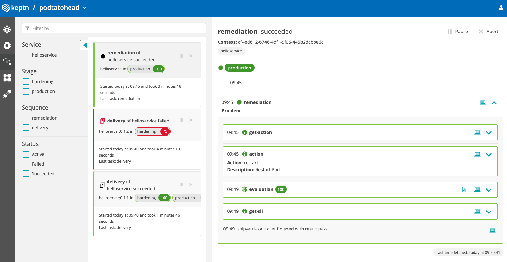

This Quick Start guide enables you to quickly access a Keptn environment locally
and run some simple exercises that demonstrate Keptn functionality.
The steps are:

* Download a container (either Docker or Kubernetes)
that provides a small but complete Kubernetes cluster with Keptn installed.
* Run a simple exercise that runs a Quality Gate
against a multi-stage delivery operation.
* Run another exercise that shows how the Keptn auto-remediation feature
can automatically fix problems that the quality gates report.

## Install Keptn in a container

We provide a Docker container that you can install locally.
Alternatively, we provide a Helm chart that can installed on your own cluster
to provide the Keptn installation.
You need to have about 12GB of memory and 50-60 GB of disk space to install these containers.

You can instead install Keptn yourself on either an existing Kubernetes cluster
or a cluster that you create;
instructions, including information about creating a small Kubernetes locally,
are in [Install CLI and Keptn](../0.14.x/operate/install).

### Install Keptn with a Helm chart

1) Install core control plane components and expose via a LoadBalancer:
```
helm repo add keptn https://charts.keptn.sh && helm repo update
helm install keptn keptn/keptn \
-n keptn --create-namespace \
--wait \
--set=control-plane.apiGatewayNginx.type=LoadBalancer
```

2) Install the execution plane components. These are additional microservices that handle specific tasks:

```
helm install jmeter-service keptn/jmeter-service -n keptn
helm install helm-service keptn/helm-service -n keptn
```

### Install Keptn Hello World (Docker Based)


### Prerequisites for Hello World

- Machine with Docker installed and at least 8GB RAM
- [Start Docker on your system]

Run the Keptn Hello, World! example:

```
docker run --rm -it \
--name thekindkeptn \
-v /var/run/docker.sock:/var/run/docker.sock:ro \
--add-host=host.docker.internal:host-gateway \
gardnera/thekindkeptn:0.0.12
```

The Keptn Bridge (UI) is available on `http://localhost`

### Outcome

The command above has:

- Created a Kubernetes cluster in Docker using [k3d](https://k3d.io/)
- Installed Keptn and removed all authentication (for demo purposes)
- Installed and authenticated the `keptn` CLI
- Created a `helloworld` project
- Ran your first `hello` Keptn sequence

You can also run additional `hello` sequences with: `keptn send event -f /helloevent.cloudevent.json`


## Exercise 1: Multi-Stage Delivery

This exercise performs a [**multi-stage delivery**](../concepts/delivery/)
with [SLO-based quality gates](../concepts/quality_gates/) in place.
Please note this creates a local repository `examples/` in your current directory.
Make sure to run it from a directory you are fine having the examples stored in.

```bash
cd ??
curl -SL https://raw.githubusercontent.com/keptn/examples/master/quickstart/multistage-delivery.sh | bash
```

<details><summary>What you'll see</summary>
<p>In Keptn you'll see one successful quality gate evaluation and one failed evaluation, that means a slow build will never reach production!

</p>
</details>

What did this exercise do?

This exercise includes a small application called podtatohead.

* This uses a Service Level Indicator (SLI) that represents [the time to do something] in the application.
And SLI is a value that that can represent any information
that your observability data platform stores about your software..
This exercise uses an SLI that is included in Keptn by default for Prometheus,
which is the data platform we are using.
You can also define your own SLIs for any value that can be calculated
from the data provided by your observability platform.

* [omitting mention of keptn add-resource -- seems an unnecessary complication here]

* This then sets a Service Level Objective (SLO [link to ref page)] of [slo value].
You can set an SLO as an actual number (for example, 10 or `less than or equal to 5")
or you can set it to compare to a previous run (e.g. at least 5ms faster than previous run).

    * The items in the `Name` column are metrics defined for the SLI provider conntected to Keptn.
For this exercise, we are using Prometheus,
so the `prometheus-service` is connected to a Prometheus Environment,
which is configured as a secret and referenced in the *dynatrace.conf.yaml.

    * The `Value` column shows the value calculated for this evaluation.

    * The `Pass criteria` column represents the SLO defined for each item.

    * The `Results` column shows the results of the evaluation process for this metric.

* Each Keptn project has a *shipyard.yaml* [link to ref page]
that defines the activities Keptn performs and the order in which they run.
The *shipyard* file is arranged in stages,
each of which includes sequences that define tasks.
For this exercise, we have a small *shipyard* file with a single stage called **delivery**

* Keptn evaluations are triggered by events.
Triggers can be defined in the *shipyard* file or through the API.
For this exercise, we trigger the evaluation with the [command].

* When an event of the appropriate type is received,
the `lighthouse-service` determines the data source (currently, either Prometheus or Dynatrace),
then sends an event to tell that data source to retrieve the appropriate SLI and SLO information
and it then evaluates the results.

* [Explain what evaulation lighthouse does here and how it leads to what is displayed]

* [Should we show the "Evaluation of test on production" screen and discuss briefly?
Something like the following:

* The "Evaluation of test on production" screen provides some details.]


## Exercise 2: Try Auto-Remediation

When Keptn discovers a "problem" in your application
(in other words, an SLO that is not met),
it can take `actions` to try to fix the problem.
This is called "Auto-Remediation".

Exercise 2 gives a simple example of how
[**automated operations**](../concepts/automated_operations/) capability.
It builds on Exercise 1 so be sure to run that before attempting to run this exercise.

When you are ready, execute the following command:

```bash
curl -SL https://raw.githubusercontent.com/keptn/examples/master/quickstart/automated-operations.sh | bash
```

<details><summary>What you'll see</summary>
<p>In Keptn you'll see an executed remediation sequence in response to a problem event that has been sent to Keptn!

</p>
</details>

What did this exercise do?

* [runs evaluation]

* If the evaluation fails, Keptn can take actions based on what is defined in the *shipyard* file.
Actions include `release` and `rollback`.
Autoremediation is implemented by the `get-action` action,
which extracts the remediation option from the *remediation.yaml* file.

* in this case, the action defined is to restart the pod where the test is run.

* Keptn takes this action then reruns the evaluation to see if the remediation solved the problem.

* If the evaluation still fails, Keptn executes the next action (if one is defined)
to try to remediate the problem.

* If Keptn executes all the defined actions and the evaluation still fails,
Keptn [does what?]

## Explore Keptn

Now you have a running Keptn instance, keep exploring it!
Please have a look at our [tutorials](https://tutorials.keptn.sh) and [documentation](../) to learn how you can use Keptn.

### Explore tutorials to learn more about the Keptn use cases

With Keptn installed, have a look at the different [tutorials](https://tutorials.keptn.sh/) to learn hands-on about the Keptn use cases:

<table class="highlight-table">
  <tr>
    <td colspan="6">
      <a href="https://tutorials.keptn.sh/?cat=full-tour">
        <strong>A full tour through Keptn: Continuous Delivery & Automated Operations</strong><br><br>
        Learn how to setup Keptn for a sample cloud native app where Keptn deploys, tests, validates, promotes and auto-remediates
      </a>
    </td>
  </tr>
  <tr>
    <td colspan="3" width="50%">
      <a href="https://tutorials.keptn.sh/?cat=quality-gates">
        <strong>Continuous Delivery with Deployment Validation</strong><br><br>
        Keptn deploys, tests, validates and promotes your artifacts across a multi-stage delivery process
      </a>
    </td>
    <td colspan="3">
      <a href="https://tutorials.keptn.sh/?cat=automated-operations">
        <strong>Automated Operations</strong><br><br>
        Keptn automates problem remediation in production through self-healing and runbook automation
      </a>
    </td>
  </tr>
  <tr>
    <td colspan="2" width="33%">
        <strong>Performance as a Self-Service</strong><br><br>
        Keptn deploys, tests and provides automated performance feedback of your artifacts
    </td>
    <td colspan="2" width="33%">
        <strong>Performance Testing as a Self-Service</strong><br><br>
        Let Keptn execute performance tests against your deployed software and provide automatic SLI/SLO based feedback
    </td>
    <td colspan="2">
        <strong>Deployment Validation (aka Quality Gates)</strong><br><br>
        Integrate Keptn into your existing CI/CD by automatically validating your monitored environment based on SLIs/SLOs
    </td>
  </tr>
</table>

### Learn how Keptn works and how it can be adapted to your use cases

Review the documentation for a full reference on all Keptn capabilities and components and how they can be combined/extended to your needs:

- [Operate Keptn](../0.14.x/operate)
- [Manage Keptn](../0.14.x/manage)
- [Continuous Delivery](../0.14.x/continuous_delivery)
- [Quality Gates](../0.14.x/quality_gates)
- [Automated Operations](../0.14.x/automated_operations)
- [Custom Integrations](../0.14.x/integrations)

## Wrapping up

If you are finished exploring Keptn, you can always stop and start the cluster and delete it eventually.

```bash
k3d cluster stop mykeptn
k3d cluster start mykeptn
```

Or delete it if you don't need it anymore

```bash
k3d cluster delete mykeptn
```

## FAQ

### Kubernetes version not supported
In case `keptn install` prevents you from installing Keptn due to a (currently) unsupported Kubernetes version, you can bypass this check at your own risk by using the Helm installation option of Keptn.

```bash
helm install keptn https://github.com/keptn/keptn/releases/download/0.14.1/keptn-0.14.1.tgz -n keptn --create-namespace --set=continuous-delivery.enabled=true --wait
helm install helm-service https://github.com/keptn/keptn/releases/download/0.14.1/helm-service-0.14.1.tgz -n keptn --create-namespace --wait
helm install jmeter-service https://github.com/keptn/keptn/releases/download/0.14.1/jmeter-service-0.14.1.tgz -n keptn --create-namespace --wait
```

Now continue with step 4 from the quickstart guide.

### Disk pressure on pods in Kubernetes

If the installation of Keptn is timing out, you can check if the root cause are low resources, such as disk space, by executing `kubectl describe pod PODID -n keptn`.executing

Please ensure that your local k3d environment has enough resources. You can verify this in your Docker resource settings. This quickstart guide has been tested with the following configuration:
<details><summary>Resources</summary>

</details>

### Docker resources
Please make sure your Docker environment has been granted enough resources to run k3d and Keptn on top of it.
This quickstart guide has been tested with the following configuration:
<details><summary>Resources</summary>

</details>

### How to get more help?

Join [our slack channel](https://slack.keptn.sh) for any questions that may arise.
There is a special `#help` channel for Keptn users when you can get help from the Keptn team.
